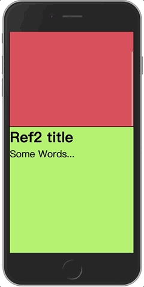

# react-magic-scroll

🖱️ A react library for adding some effects you want when scroll.

 



## Installation

```shell
npm i -S @zhangsai/react-magic-scroll
```

## Usage

### Step1: Write a normal scroll layout

```html
<div className="container" ref={containerRef}>
  <div className="box">
    <h1>Ref1 title</h1>
    <p>Some Words...</p>
  </div>
  ...
</div>
```

```css
body, html, #root {
  height: 100%;
}

.container {
  height: 100%;
  overflow-y: auto;
}

.box {
  height: 500px;
  border: 1px solid #000;
}
```

### Step2. Set Container

```js
import { withMagicScroll, useMagicScrollConsumer, MagicScrollProvider } from '@zhangsai/react-magic-scroll';

function YourComponent() {
  const { containerRef } = useMagicScrollConsumer();
  return (
    <div className="container" ref={containerRef}>
      ...
    </div>
  );
}

export default withMagicScroll(App); // or use MagicScrollProvider
```

### Step3. Set scrolling target

```js
import { easeCubicOut } from 'd3-ease';
import { scaleLinear } from 'd3-scale';

function YourComponent() {
  const { containerRef } = useMagicScrollConsumer();
  return (
    <div className="container" ref={containerRef}>
      <MagicScroll className="box"
        duration={500}
        offset={0}
        onProcess={(process, ref) => {
          // Do any effects you want.
          const bezieredProcess = easeCubicOut(process);
          ref.style.transform = `matrix(1, 0, 0, 1, 0, ${150 * (1 - bezieredProcess)})`;
          ref.style.opacity = String(bezieredProcess);
          ref.style.backgroundColor = color3(process);
        }}
      >
        <h1>Title</h1>
        <p>Some Words...</p>
      </MagicScroll>
    </div>
  );
}
```

When the target by MagicScroll appear at the bottom of browser (what `offset={0}` means), `duration` will be started from 0, `onProcess` will be called with params `process` and `ref`, until `duration` to be `500`.

- `process:` Percant of duration
- `ref:` Target dom, set any animation we want, like `transform`、`opacity`、`color`..., we can also use some helpers, like `d3`、`anime`、`tweenmax`...

### Or use useMagicScroll instead

```js
import { useMagicScroll, TargetOption } from '@zhangsai/react-magic-scroll';

function YourComponent() {
  const { containerRef } = useMagicScrollConsumer();
  const ref = React.useRef<HTMLDivElement>(null);

  const targetOptions = React.useMemo<TargetOption[]>(() => {
    return [
      {
        targetRef: ref,
        duration: 500,
        offset: 0,
        onProcess(process, ref) {
          const bezieredProcess = easeCubicOut(process);
          ref.style.transform = `matrix(1, 0, 0, 1, 0, ${150 * (1 - bezieredProcess)})`;
          ref.style.opacity = String(bezieredProcess);
        },
      },
    ];
  }, []);

  useMagicScroll(targetOptions);

  return (
    <div className="container" ref={containerRef}>
      <div ref={ref} className="box">
        <h1>Ref1 title</h1>
        <p>Some Words...</p>
      </div>
    </div>
  );
}
```
